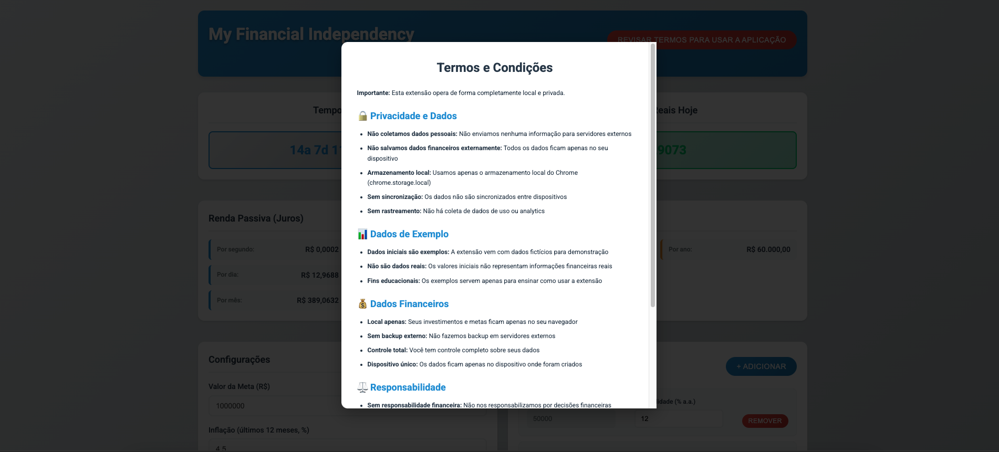
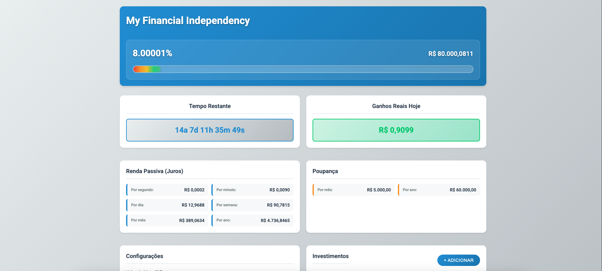
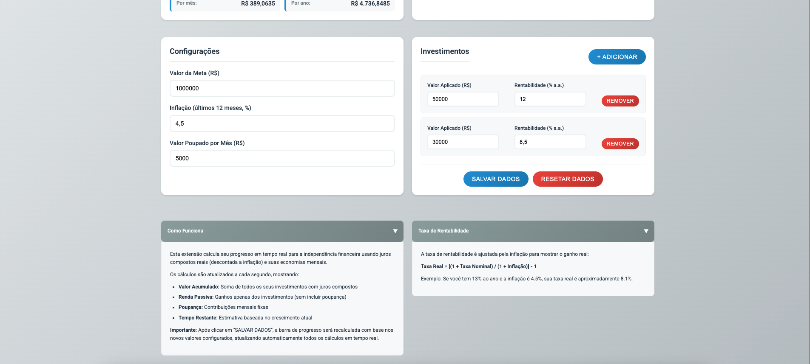

# My Financial Independency

A **locally-only** Chrome extension that helps you track your progress towards financial independence with real-time compound interest calculations. This extension operates **entirely offline** and **does not collect, transmit, or store any data on external servers**. All data remains on your device, providing complete privacy and security.

## Features

- **Real-time Calculations**: Updates every second with compound interest calculations
- **Multiple Investments**: Track multiple investment accounts with different rates
- **Inflation Adjustment**: All calculations use real rates (nominal rate adjusted for inflation)
- **Progress Tracking**: Visual progress bar and percentage towards your goal
- **Time Estimation**: Calculate remaining time to reach financial independence
- **Milestone Notifications**: Get notified when you reach 5% milestones
- **Data Persistence**: All data is saved locally on your device
- **Modern UI**: Clean, professional interface with Flat UI Colors





## Installation

### Development Setup

1. **Install Dependencies**
   ```bash
   npm install
   ```

2. **Build the Extension**
   ```bash
   # Development build
   npm run build:dev
   
   # Production build
   npm run build:prod
   
   # Watch mode for development
   npm run watch
   ```

3. **Load in Chrome**
   - Open Chrome and go to `chrome://extensions/`
   - Enable "Developer mode"
   - Click "Load unpacked" and select the `dist/` folder
   - The extension will appear in your Chrome toolbar

### Production Installation

1. Download the extension from the Chrome Web Store (coming soon)
2. Click "Add to Chrome" when prompted
3. The extension will be automatically installed and ready to use

## Usage

### Initial Setup

1. **Set Your Goal**: Enter your target amount for financial independence
2. **Configure Inflation**: Set the current inflation rate (default: 4.5%)
3. **Set Monthly Savings**: Enter how much you save each month
4. **Add Investments**: Add your investment accounts with their rates
5. **Save Data**: Click "Salvar Dados" to save your configuration

### Tracking Progress

- The extension updates every second with real-time calculations
- View your total accumulated amount and progress percentage
- Monitor passive income from investments (excluding savings)
- Track savings contributions separately
- See estimated time remaining to reach your goal

### Notifications

- Receive notifications when you reach 5% milestones (5%, 10%, 15%, etc.)
- Notifications are sent through Chrome's notification system
- You can disable notifications in Chrome's notification settings

## Technical Details

### Architecture

- **Manifest V3**: Uses the latest Chrome extension standard
- **TypeScript**: Full type safety and modern JavaScript features
- **Service Worker**: Background processing for notifications and data persistence
- **Chrome Storage API**: Local data persistence on device
- **Real-time Updates**: 1-second intervals for live calculations

### Calculations

- **Real Rate**: `[(1 + nominalRate) / (1 + inflationRate)] - 1`
- **Compound Interest**: `currentAmount * realRate / (seconds in year)`
- **Savings Distribution**: `monthlySavings / (30 * 24 * 60 * 60) / investments.length`
- **Time Remaining**: `(goal - current) / (earningsPerSecond + savingsPerSecond)`

### Data Model

```typescript
interface Investment {
  initialAmount: number;
  currentAmount: number;
  rate: number;
  earningsPerSecond: number;
}

interface AppState {
  investments: Investment[];
  goalAmount: number;
  inflationRate: number;
  monthlySavings: number;
  totalInvested: number;
  startOfDay: number;
  lastNotificationPercentage: number;
}
```

## Development

### Project Structure

```
my-financial-independency/
├── src/
│   ├── popup/
│   │   ├── popup.html
│   │   ├── popup.ts
│   │   └── popup.css
│   ├── background/
│   │   └── background.ts
│   ├── types/
│   │   └── interfaces.ts
│   └── utils/
│       └── calculations.ts
├── icons/
├── manifest.json
├── webpack.config.js
├── tsconfig.json
└── package.json
```

### Build Commands

- `npm run build` - Production build
- `npm run build:dev` - Development build with source maps
- `npm run watch` - Watch mode for development
- `npm run clean` - Clean dist folder

### Testing

1. Load the extension in Chrome
2. Open Chrome DevTools to see console logs
3. Test all functionality:
   - Add/remove investments
   - Save/reset data
   - Real-time calculations
   - Notifications
   - Data persistence

## Privacy & Security

- **Local Storage Only**: All data is stored locally using Chrome's local storage API
- **No External Servers**: The extension works completely offline
- **No Data Collection**: We don't collect, transmit, or store any data whatsoever
- **No External Communication**: No data is ever sent to external servers
- **Complete Privacy**: Your financial data never leaves your device
- **Open Source**: Full source code is available for review

## Contributing

1. Fork the repository
2. Create a feature branch
3. Make your changes
4. Test thoroughly
5. Submit a pull request

## License

MIT License - see LICENSE file for details

## Support

For issues, feature requests, or questions:
- Create an issue on GitHub
- Check the documentation
- Review the source code

## 📚 Documentation

This project includes comprehensive documentation to help you understand and use the extension:

### **Getting Started**
1. **New Users**: Start with [USER_GUIDE.md](USER_GUIDE.md) for complete setup instructions
2. **Privacy Concerns**: Read [PRIVACY_POLICY.md](PRIVACY_POLICY.md) to understand data handling
3. **Legal Terms**: Review [TERMS_OF_SERVICE.md](TERMS_OF_SERVICE.md) before using the extension
4. **Updates**: Check [CHANGELOG.md](CHANGELOG.md) for latest features and improvements

## Changelog

### Version 1.0.0
- Initial release
- Real-time compound interest calculations
- Multiple investment tracking
- Inflation adjustment
- Progress visualization
- Milestone notifications
- Data persistence
- Modern UI design
