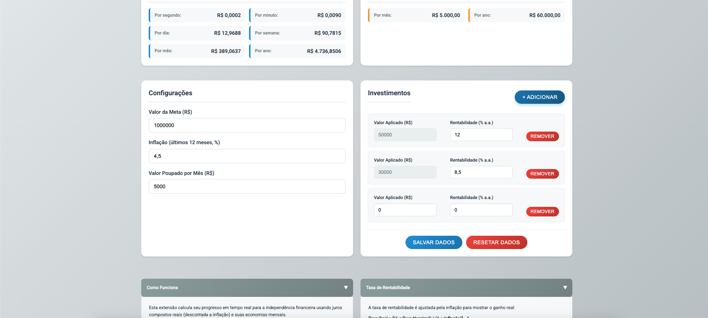

# My Financial Independency - User Guide

**Version:** 1.0.0  
**Last Updated:** 2025-09-02

## 📖 **Overview**

My Financial Independency is a **locally-only** Chrome extension that helps you track your progress towards financial independence with real-time compound interest calculations. The extension operates **entirely offline** and **does not collect, transmit, or store any data on external servers**. All data remains on your device, providing complete privacy and security.

The extension provides a comprehensive financial dashboard that updates every second, showing your progress, earnings, and estimated time to reach your financial goals - all calculated locally on your device.

### **🎯 Key Features**

- **Real-time Calculations**: Updates every second with compound interest calculations **performed locally**
- **Multiple Investments**: Track unlimited investment accounts with different rates **stored locally**
- **Inflation Adjustment**: All calculations use real rates (nominal rate adjusted for inflation) **calculated locally**
- **Progress Tracking**: Visual progress bar and percentage towards your goal **displayed locally**
- **Time Estimation**: Calculate remaining time to reach financial independence **calculated locally**
- **Milestone Notifications**: Get notified when you reach 5% progress milestones **generated locally by Chrome**
- **Data Persistence**: All data is saved **locally on your device** (no sync across browsers)
- **Modern UI**: Professional financial dashboard with Flat UI Colors design
- **Complete Privacy**: **No data collection, no external transmission, no external storage**

## 🚀 **Getting Started**

### **Installation**
1. **Download**: Install from the Chrome Web Store (coming soon)
2. **Pin Extension**: Click the extension icon in your browser toolbar
3. **First Launch**: The extension will open with default settings

### **Initial Setup**
1. **Review Example Data**: The extension comes with example investment data for demonstration
2. **Replace with Your Data**: Replace all example data with your actual financial information
3. **Set Your Goal**: Enter your target amount for financial independence
4. **Configure Inflation**: Set the current inflation rate (default: 4.5%)
5. **Set Monthly Savings**: Enter how much you save each month
6. **Add/Edit Investments**: Add your investment accounts with their rates or edit the examples
7. **Save Data**: Click "Salvar Dados" to save your configuration

### **Opening the Extension**
- **Click the extension icon** in your browser toolbar
- **Or use keyboard shortcut**: `Ctrl+Shift+F` (Windows/Linux) or `Cmd+Shift+F` (Mac)

## 🚀 **Complete User Flow Guide**

Follow this step-by-step guide to get started with the extension:

> **📸 Screenshots**: This guide includes screenshots to help you understand each step. If screenshots are not visible, refer to the `screenshots/` directory for visual references.

### **Step 1: Accept Terms and Conditions**

When you first open the extension, you'll see a terms and conditions modal:


**What you'll see:**
- Privacy and data protection information
- Example data disclaimer
- Financial data handling details
- Responsibility disclaimers

**What to do:**
1. **Read the terms carefully**
2. **Check the acceptance checkbox**
3. **Click "Aceitar e Continuar" (Accept and Continue)**

> **Note**: You must accept the terms to use the extension. If you refuse, the "REVISAR TERMOS PARA USAR A APLICAÇÃO" button will appear in the header.

### **Step 2: View Example Investments**

After accepting terms, you'll see the main interface with example investments:


**What you'll see:**
- **Progress Bar**: Shows 8.00% progress (R$ 80,000 of R$ 1,000,000 goal)
- **Example Investment 1**: R$ 50,000 at 12.0% annual rate
- **Example Investment 2**: R$ 30,000 at 8.5% annual rate
- **Real-time Calculations**: Updates every second

**What to do:**
1. **Observe the calculations** working in real-time
2. **Try editing the rates** to see how calculations change
3. **Notice the progress bar** showing your progress toward the goal

### **Step 3: Read the Information Sections**

Scroll down to read the explanatory sections:


**"Como Funciona" (How It Works) Section:**
- Explains compound interest calculations
- Describes real-time updates
- Shows what each display means
- Mentions progress bar recalculation after saving

**"Taxa de Rentabilidade" (Return Rate) Section:**
- Explains inflation adjustment
- Shows the real rate formula
- Provides calculation examples

**What to do:**
1. **Click on "Como Funciona"** to expand and read
2. **Click on "Taxa de Rentabilidade"** to understand rate calculations
3. **Familiarize yourself** with the calculation methods

### **Step 4: Add Your Own Investments**

Now it's time to replace the examples with your real data:



**To add a new investment:**
1. **Click "+ Adicionar"** button in the investments section
2. **Enter your investment amount** in "Valor Aplicado (R$)"
3. **Enter your annual rate** in "Rentabilidade (% a.a.)"
4. **The calculation will update** automatically

**To remove example investments:**
1. **Click "Remover"** button on any example investment
2. **The investment will be deleted** and calculations updated

### **Step 5: Update Configuration Data**

Update the global settings with your real data:

**Update these fields:**
1. **Valor da Meta (Goal Amount)**: Enter your financial independence target
2. **Inflação (Inflation Rate)**: Set current inflation rate (default: 4.5%)
3. **Valor Poupado por Mês (Monthly Savings)**: Enter your monthly savings amount

**What happens:**
- **Progress bar recalculates** based on your new goal
- **Time remaining updates** based on your savings rate
- **All calculations adjust** to your real data

### **Step 6: Save Your Data**

Once you've configured everything:

**To save your configuration:**
1. **Click "Salvar Dados"** button
2. **Data is validated** and saved to local storage
3. **Progress bar recalculates** with your new values
4. **All future calculations** use your saved data

**What gets saved:**
- All your investments (amounts and rates)
- Goal amount and inflation rate
- Monthly savings amount
- Terms acceptance status

### **Step 7: Monitor Your Progress**

After saving, monitor your real-time progress:

**What you'll see:**
- **Updated progress percentage** based on your goal
- **Real-time earnings** from your investments
- **Accurate time remaining** calculation
- **Live updates** every second

**Key features:**
- **Milestone notifications** at 5% progress intervals
- **Daily earnings tracking** since start of day
- **Compound interest calculations** with inflation adjustment

### **Troubleshooting the User Flow**

#### **If you don't see the terms modal:**
- The extension may already be installed and terms accepted
- Click the "REVISAR TERMOS PARA USAR A APLICAÇÃO" button in the header
- Or reset the extension data to see the first-time experience

#### **If you don't see example investments:**
- Clear your browser data for the extension
- Or click "Resetar Dados" to start fresh
- Example investments only appear for new installations

#### **If calculations don't update:**
- Make sure you've clicked "Salvar Dados" after making changes
- Check that all required fields are filled
- Verify that terms have been accepted

#### **If progress bar doesn't show:**
- Ensure terms have been accepted
- Check that you have at least one investment configured
- Make sure your goal amount is set correctly

## 💰 **Understanding the Interface**

### **Header Section**
- **Progress Percentage**: Shows your current progress towards the goal (5 decimal places)
- **Current Amount**: Total accumulated value from all investments (4 decimal places)
- **Progress Bar**: Visual representation of your progress with gradient colors

### **Time Remaining**
- **Intelligent Formatting**: Shows years, days, hours, minutes, seconds
- **Omits Zero Values**: Only shows relevant time units (e.g., "1a 120d 5h 30m 15s")
- **Real-time Updates**: Updates every second based on current growth rate

### **Earnings Today**
- **Real Earnings**: Shows earnings from investments only (excluding savings)
- **Since Start of Day**: Calculated from 00:00:00 of the current day
- **4 Decimal Places**: Precise tracking of daily earnings

## 📊 **Financial Calculations**

### **Real Rate Calculation**
The extension adjusts all investment rates for inflation using the formula:
```
Real Rate = [(1 + Nominal Rate) / (1 + Inflation Rate)] - 1
```

**Example:**
- Nominal Rate: 13.2% per year
- Inflation Rate: 4.5% per year
- Real Rate: [(1 + 0.132) / (1 + 0.045)] - 1 = 8.1% per year

### **Compound Interest**
- **Updates Every Second**: Interest is compounded continuously
- **Formula**: `currentAmount * realRate / (seconds in year)`
- **Precision**: High-precision calculations for accurate results

### **Savings Distribution**
- **Monthly to Per-Second**: `monthlySavings / (30 * 24 * 60 * 60)`
- **Proportional Distribution**: Savings are distributed equally across all investments
- **Real-time Addition**: Added to each investment every second

## 📈 **Earnings Breakdown**

### **Passive Income (Juros)**
Shows earnings from investments only, excluding savings contributions:

- **Por segundo**: Earnings per second from all investments
- **Por minuto**: Earnings per minute (×60)
- **Por dia**: Earnings per day (×86,400)
- **Por semana**: Earnings per week (×604,800)
- **Por mês**: Earnings per month (×2,592,000)
- **Por ano**: Earnings per year (×31,536,000)

### **Savings Section**
Shows your monthly savings contributions:

- **Por mês**: Your configured monthly savings amount
- **Por ano**: Annual savings (monthly × 12)

## ⚙️ **Configuration**

### **Goal Amount**
- **Purpose**: Your target amount for financial independence
- **Format**: Enter in Brazilian Real (R$)
- **Example**: 1,000,000 for R$ 1 million

### **Inflation Rate**
- **Purpose**: Used to calculate real returns
- **Format**: Annual percentage
- **Default**: 4.5% (Brazilian inflation average)
- **Source**: Use official inflation data from IBGE or similar

### **Monthly Savings**
- **Purpose**: Fixed amount you save each month
- **Format**: Enter in Brazilian Real (R$)
- **Distribution**: Automatically distributed across all investments

## 💼 **Investment Management**

### **Adding Investments**
1. **Click "Adicionar"**: Add a new investment entry
2. **Enter Amount**: Initial amount invested (R$)
3. **Enter Rate**: Annual interest rate (%)
4. **Save**: Click "Salvar Dados" to save changes

### **Investment Properties**
- **Valor Aplicado**: Initial amount invested
- **Rentabilidade**: Annual interest rate (nominal)
- **Current Value**: Automatically calculated with compound interest
- **Earnings Per Second**: Real-time earnings calculation

### **Editing Investments**
- **New Investments**: Amount field is editable
- **Existing Investments**: Amount field is disabled (represents live compounding value)
- **Rate Changes**: Always editable for all investments
- **Removal**: Use "Remover" button to delete investments

## 🔔 **Notifications**

### **Milestone System**
- **5% Increments**: Notifications at 5%, 10%, 15%, 20%, etc.
- **Chrome Notifications**: Uses Chrome's notification system
- **Duplicate Prevention**: Only sends notification once per milestone
- **Permission Required**: Chrome will ask for notification permission

### **Notification Content**
- **Title**: "My Financial Independency"
- **Message**: "Parabéns! Você atingiu X% da sua meta de independência financeira!"
- **Icon**: Extension icon
- **Click Action**: Opens the extension popup

## 💾 **Data Management**

### **Automatic Saving**
- **Every Second**: Data is automatically saved during calculations
- **Local Storage**: Data is stored locally on your device only
- **No Data Loss**: Continuous saving prevents data loss

### **Manual Save**
- **"Salvar Dados" Button**: Manually save configuration changes
- **Validation**: Validates all inputs before saving
- **Success Feedback**: Shows confirmation message
- **Scroll to Top**: Automatically scrolls to top after saving

### **Reset Data**
- **"Resetar Dados" Button**: Clear all data and start fresh
- **Confirmation Dialog**: Requires explicit confirmation
- **Complete Reset**: Removes all investments, settings, and progress
- **Irreversible**: Cannot be undone

## 📚 **Understanding the Calculations**

### **How It Works**
1. **Real Rate Calculation**: Adjusts nominal rates for inflation
2. **Compound Interest**: Calculates interest every second
3. **Savings Addition**: Adds proportional savings to each investment
4. **Progress Calculation**: Compares current total to goal
5. **Time Estimation**: Calculates remaining time based on current growth rate

### **Time Remaining Formula**
```
Time Remaining = (Goal - Current Total) / (Total Earnings Per Second + Savings Per Second)
```

### **Progress Percentage**
```
Progress = (Current Total / Goal) × 100
```

## 🎨 **User Interface**

### **Design System**
- **Colors**: Flat UI Colors palette
- **Typography**: Roboto font family
- **Layout**: Modern financial dashboard design
- **Responsive**: Works on different screen sizes

### **Visual Elements**
- **Progress Bar**: Gradient from red to green
- **Buttons**: Pill-shaped with hover effects
- **Inputs**: Rounded with blue focus states
- **Cards**: Subtle shadows and rounded corners

### **Accessibility**
- **Keyboard Navigation**: Full keyboard support
- **Screen Readers**: ARIA labels and semantic HTML
- **High Contrast**: Good color contrast ratios
- **Focus Indicators**: Clear focus states

## 🔧 **Troubleshooting**

### **Common Issues**

#### **Calculations Not Updating**
- **Check Inputs**: Ensure all required fields are filled
- **Save Data**: Click "Salvar Dados" to save configuration
- **Refresh**: Close and reopen the extension
- **Validate Data**: Check for invalid values (negative numbers, etc.)

#### **Notifications Not Working**
- **Check Permissions**: Ensure Chrome notifications are allowed
- **Browser Settings**: Verify Chrome notification settings
- **Extension Status**: Check if the extension is enabled
- **Test Notifications**: Try setting a low goal to trigger milestones quickly

#### **Data Not Saving**
- **Local Storage**: Data is stored locally on your device only
- **Browser Restart**: Restart Chrome to refresh local storage
- **Manual Save**: Use "Salvar Dados" to force save
- **Storage Check**: Check if Chrome has sufficient local storage space

### **Frequently Asked Questions**

#### **Q: What is the example data that comes with the extension?**
A: The extension comes with fictional example investment data (R$ 50,000 at 12% and R$ 30,000 at 8.5%) for demonstration purposes. This is not real financial data and should be replaced with your actual investment information.

#### **Q: How accurate are the calculations?**
A: The calculations use high-precision mathematics and update every second. However, they are estimates based on the data you provide and should not be considered as guaranteed outcomes.

#### **Q: Can I use this for multiple financial goals?**
A: Currently, the extension supports one main financial independence goal. You can change the goal amount at any time.

#### **Q: What happens if I change an investment rate?**
A: The new rate will be applied to future calculations. The current value will continue to compound with the new rate.

#### **Q: How do I account for taxes?**
A: The extension doesn't include tax calculations. You should consult with a tax professional for tax planning.

#### **Q: Can I export my data?**
A: Currently, data export is not available, but it's planned for future versions. Your data is stored locally on your device only.

## 📱 **Best Practices**

### **For Accurate Tracking**
- **Regular Updates**: Update investment rates when they change
- **Realistic Goals**: Set achievable financial independence goals
- **Current Inflation**: Use current inflation rates for accurate real returns
- **Consistent Savings**: Maintain consistent monthly savings amounts

### **For Data Management**
- **Regular Saves**: Use "Salvar Dados" after making changes
- **Data Backup**: Consider exporting data periodically
- **Input Validation**: Double-check all input values
- **Goal Review**: Regularly review and adjust your financial goals

### **For Privacy**
- **Local Storage**: All data is stored locally on your device
- **No External Servers**: No financial data is transmitted to external servers
- **Local Storage**: Data storage is handled by Chrome's secure local storage system
- **Device Security**: Keep your device secure to protect your financial data

## 🆘 **Support & Contact**

### **Getting Help**
- **User Guide**: This document contains most answers
- **Extension Interface**: Check the collapsible help sections
- **Chrome Extensions**: Check Chrome's extension management page

## 📄 **Legal & Disclaimers**

### **Financial Disclaimer**
**THIS EXTENSION IS FOR INFORMATIONAL AND TRACKING PURPOSES ONLY. IT IS NOT INTENDED AS FINANCIAL ADVICE. ALWAYS CONSULT WITH QUALIFIED FINANCIAL PROFESSIONALS BEFORE MAKING INVESTMENT DECISIONS. THE CALCULATIONS PROVIDED ARE ESTIMATES AND SHOULD NOT BE CONSIDERED AS GUARANTEED OUTCOMES.**

### **No Responsibility**
- **WE ASSUME NO RESPONSIBILITY FOR ANY FINANCIAL DECISIONS OR OUTCOMES**
- **WE ARE NOT RESPONSIBLE FOR ANY INVESTMENT LOSSES OR GAINS**
- **WE ARE NOT RESPONSIBLE FOR THE ACCURACY OF ANY CALCULATIONS**
- **WE ARE NOT RESPONSIBLE FOR ANY FINANCIAL CONSEQUENCES OF USING THIS EXTENSION**
- **USE THIS EXTENSION AT YOUR OWN RISK AND RESPONSIBILITY**

### **Investment Risks**
- Past performance does not guarantee future results
- Investment values can go up or down
- Inflation rates and market conditions can change
- Your actual returns may differ from calculated estimates
- **We are not responsible for any investment losses or gains**

### **Privacy Policy**
Review our Privacy Policy for detailed information about our **no-data-collection policy** and local-only operation.

### **Terms of Service**
Review our Terms of Service for the complete terms and conditions of using this extension, including our **zero-liability policy**.

## 🎯 **Future Features**

### **Planned Updates**
- **Investment Categories**: Categorize investments by type
- **Historical Charts**: Visual progress charts over time
- **Export Functionality**: Export data to CSV/Excel
- **Multiple Goals**: Support for multiple financial goals
- **Currency Support**: Multiple currency support
- **Advanced Calculations**: Tax-adjusted returns and more sophisticated models
- **Dark Mode**: Alternative dark theme
- **Internationalization**: Multi-language support

---

**Thank you for using My Financial Independency!** 🎉

This extension is designed to help you track your journey towards financial independence with accurate, real-time calculations. Remember that this is a tracking tool, not financial advice. Always consult with qualified financial professionals for investment decisions.
